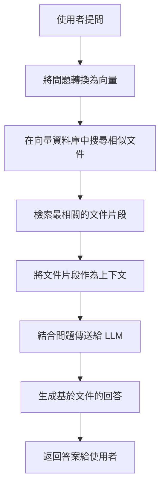

# LangChain RAG 問答系統

這是一個基於 LangChain 框架建立的 RAG（Retrieval Augmented Generation）文件問答系統。系統可以讀取您的文件，並根據文件內容回答問題。

## 🌟 功能特色

- ✅ 支援多種文件格式（TXT、PDF）
- ✅ 使用向量資料庫進行高效的語義搜尋
- ✅ 基於 OpenAI GPT 模型生成準確的回答
- ✅ 互動式命令列介面
- ✅ 可查看相關文件片段
- ✅ 模組化設計，易於擴展

## 📋 系統需求

- Node.js 18.0 或更高版本
- OpenAI API 金鑰

## 🚀 快速開始

### 1. 安裝依賴

```bash
cd langchain-rag-project
npm install
```

### 2. 設定環境變數

複製 `.env.example` 並重新命名為 `.env`：

```bash
cp .env.example .env
```

編輯 `.env` 檔案，填入您的 OpenAI API 金鑰：

```env
OPENAI_API_KEY=your_openai_api_key_here
OPENAI_MODEL=gpt-3.5-turbo
EMBEDDING_MODEL=text-embedding-ada-002
```

### 3. 準備文件

將您想要查詢的文件放入 `documents/` 目錄中。系統已經包含了兩個範例文件：

- `langchain_intro.txt` - LangChain 框架介紹
- `rag_explained.txt` - RAG 技術詳解

支援的文件格式：
- `.txt` - 純文字檔案
- `.pdf` - PDF 文件

### 4. 建立向量資料庫

執行以下命令來載入文件並建立向量資料庫：

```bash
npm run load-docs
```

這個步驟會：
1. 讀取 `documents/` 目錄中的所有文件
2. 將文件分割成較小的區塊
3. 使用 OpenAI Embeddings 將文字轉換為向量
4. 將向量儲存到 FAISS 向量資料庫中

### 5. 開始提問

執行以下命令啟動互動式問答系統：

```bash
npm run query
```

## 💬 使用方式

啟動問答系統後，您可以：

### 直接提問

```
💬 請輸入您的問題: 什麼是 LangChain？
```

系統會根據文件內容生成回答。

### 查看相關文件

如果您想查看系統檢索到的相關文件片段，可以在問題前加上 `docs:`：

```
💬 請輸入您的問題: docs: 什麼是 RAG？
```

### 退出系統

輸入 `exit` 或 `quit` 來退出程式。

## 📁 專案結構

```
langchain-rag-project/
├── src/
│   ├── config.js           # 配置管理
│   ├── documentLoader.js   # 文件載入和分割
│   ├── vectorStore.js      # 向量資料庫操作
│   ├── ragChain.js         # RAG Chain 實作
│   ├── loadDocuments.js    # 建立向量資料庫的腳本
│   └── query.js            # 互動式問答腳本
├── documents/              # 存放文件的目錄
│   ├── langchain_intro.txt
│   └── rag_explained.txt
├── data/                   # 向量資料庫儲存目錄（自動生成）
├── .env.example            # 環境變數範本
├── .gitignore
├── package.json
└── README.md
```

## ⚙️ 配置選項

您可以在 `.env` 檔案中調整以下設定：

```env
# OpenAI 模型設定
OPENAI_API_KEY=your_api_key
OPENAI_MODEL=gpt-3.5-turbo          # 可改為 gpt-4 等其他模型
EMBEDDING_MODEL=text-embedding-ada-002

# 向量資料庫路徑
VECTOR_STORE_PATH=./data/vectorstore
```

在 [`src/config.js`](src/config.js) 中還可以調整：

```javascript
rag: {
  chunkSize: 1000,      // 文件區塊大小
  chunkOverlap: 200,    // 區塊重疊大小
  topK: 4,              // 檢索的文件數量
}
```

## 🔧 進階使用

### 添加新文件

1. 將新文件放入 `documents/` 目錄
2. 重新執行 `npm run load-docs` 來更新向量資料庫

### 使用不同的 LLM

修改 `.env` 中的 `OPENAI_MODEL`：

```env
# 使用 GPT-4（更準確但較貴）
OPENAI_MODEL=gpt-4

# 使用 GPT-3.5 Turbo（較快且便宜）
OPENAI_MODEL=gpt-3.5-turbo
```

### 調整檢索參數

在 [`src/config.js`](src/config.js) 中調整 `topK` 值來改變檢索的文件數量：

```javascript
rag: {
  topK: 6,  // 增加到 6 個相關文件
}
```

## 📊 工作原理



## 🛠️ 故障排除

### 問題：找不到向量資料庫

**錯誤訊息：** `向量資料庫不存在`

**解決方法：** 執行 `npm run load-docs` 來建立向量資料庫

### 問題：OpenAI API 錯誤

**錯誤訊息：** `請在 .env 檔案中設定 OPENAI_API_KEY`

**解決方法：** 
1. 確認 `.env` 檔案存在
2. 確認已填入有效的 OpenAI API 金鑰
3. 確認 API 金鑰有足夠的額度

### 問題：沒有找到任何文件

**錯誤訊息：** `沒有找到任何文件`

**解決方法：** 
1. 確認 `documents/` 目錄中有文件
2. 確認文件格式為 `.txt` 或 `.pdf`

## 📚 相關資源

- [LangChain 官方文件](https://js.langchain.com/)
- [OpenAI API 文件](https://platform.openai.com/docs)
- [FAISS 向量資料庫](https://github.com/facebookresearch/faiss)

## 🤝 貢獻

歡迎提交 Issue 或 Pull Request！

## 📄 授權

MIT License

## 💡 提示

- 建議使用高品質、結構清晰的文件以獲得最佳效果
- 定期更新向量資料庫以反映文件的變更
- 可以根據需求調整 chunk size 和 overlap 參數
- 使用 `docs:` 指令可以幫助您了解系統如何檢索資訊

## 🎯 下一步

- 嘗試添加您自己的文件
- 實驗不同的配置參數
- 探索 LangChain 的其他功能
- 整合到您的應用程式中

祝您使用愉快！🚀